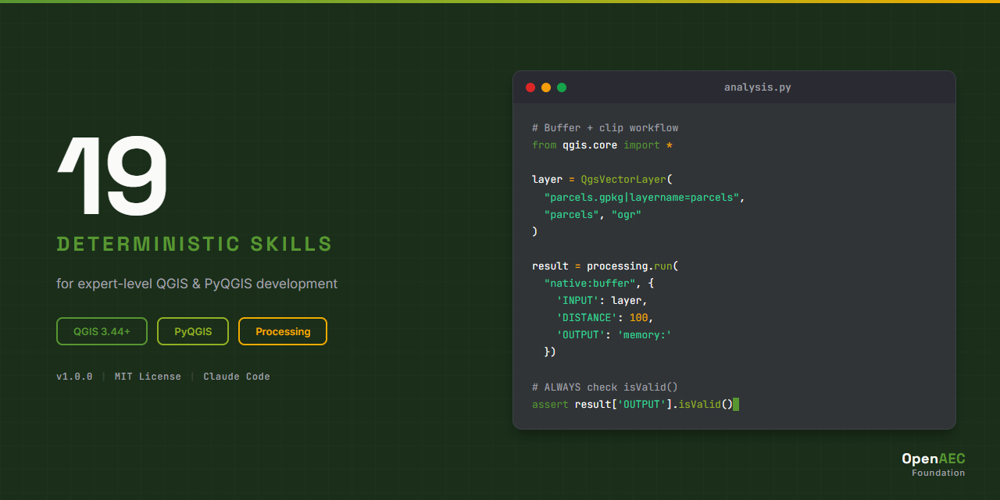

# QGIS Claude Skill Package



> 19 deterministic skills for spatial data analysis, map creation, geoprocessing, and plugin development with QGIS/PyQGIS and Claude Code.

[](https://opensource.org/licenses/MIT)
[](https://qgis.org)
[](#skill-catalog)

## What This Is

A skill package that teaches Claude how to write correct, production-quality PyQGIS code. Every skill uses deterministic ALWAYS/NEVER language, includes working code examples, and documents anti-patterns with fix patterns.

**Target version:** QGIS 3.44 LTR (with QGIS 4.0 Qt6 compatibility notes)

## Installation

### Claude Code (recommended)

```bash
claude install-skill https://github.com/OpenAEC-Foundation/QGIS-Claude-Skill-Package
```

### Manual

Clone the repository into your Claude Code skills directory:

```bash
git clone https://github.com/OpenAEC-Foundation/QGIS-Claude-Skill-Package.git
```

Then add the skills path to your Claude Code configuration.

## Skill Catalog

### Core (3 skills) — Foundation

| Skill | What it covers |
|-------|---------------|
| `qgis-core-architecture` | QGIS modules, project lifecycle, layer model, provider system, threading |
| `qgis-core-data-providers` | 12+ providers, URI formats for every data source, GeoPackage best practices |
| `qgis-core-coordinate-systems` | CRS creation, transforms, datum handling, distance measurement |

### Syntax (4 skills) — How to write PyQGIS

| Skill | What it covers |
|-------|---------------|
| `qgis-syntax-pyqgis-api` | Feature CRUD, geometry ops, spatial indexing, QgsTask, symbology |
| `qgis-syntax-expressions` | Expression engine, field calculator, custom @qgsfunction, data-defined properties |
| `qgis-syntax-processing-scripts` | processing.run(), custom algorithms, parameter types, batch processing |
| `qgis-syntax-plugins` | Plugin structure, metadata.txt, lifecycle, Qt Designer, publishing |

### Implementation (8 skills) — GIS workflows

| Skill | What it covers |
|-------|---------------|
| `qgis-impl-vector-analysis` | Spatial queries, buffer/clip/intersect/dissolve, joins, QgsVectorFileWriter |
| `qgis-impl-raster-analysis` | Map algebra, DEM analysis (hillshade/slope/aspect), GDAL algorithms |
| `qgis-impl-print-layouts` | Layout composition, atlas generation, PDF/SVG/image export |
| `qgis-impl-postgis` | PostGIS connection, SQL execution, authentication, schema discovery |
| `qgis-impl-web-services` | WMS/WFS/WMTS clients, XYZ tiles, QGIS Server, OGC API |
| `qgis-impl-3d-visualization` | 3D scenes, terrain providers, 3D symbols, materials, point clouds |
| `qgis-impl-georeferencing` | GCP management, 7 transformation types, vector/raster georeferencing |
| `qgis-impl-network-analysis` | Dijkstra shortest path, service area analysis, graph building |

### Errors (2 skills) — Diagnosis

| Skill | What it covers |
|-------|---------------|
| `qgis-errors-projections` | CRS errors, lat/lon confusion, datum warnings, diagnostic flowchart |
| `qgis-errors-data-loading` | Invalid layers, URI errors, encoding, GeoPackage locking, performance |

### Agents (2 skills) — Orchestration

| Skill | What it covers |
|-------|---------------|
| `qgis-agents-analysis-orchestrator` | Analysis planning, algorithm selection, workflow chaining, code validation |
| `qgis-agents-map-generator` | Full map pipeline: data loading → styling → layout → export |

## How to Use

| Goal | Start with |
|------|-----------|
| Plan a spatial analysis | `qgis-agents-analysis-orchestrator` |
| Generate a map | `qgis-agents-map-generator` |
| Write PyQGIS code | `qgis-syntax-pyqgis-api` |
| Load specific data format | `qgis-core-data-providers` |
| Debug projection issues | `qgis-errors-projections` |
| Build a QGIS plugin | `qgis-syntax-plugins` |
| Run processing algorithms | `qgis-syntax-processing-scripts` |

## Skill Structure

Each skill follows the same structure:

```
qgis-{category}-{topic}/
├── SKILL.md              # Main skill (<500 lines, YAML frontmatter)
└── references/
    ├── methods.md         # API signatures and class references
    ├── examples.md        # Working code examples
    └── anti-patterns.md   # What NOT to do (WRONG/CORRECT pairs)
```

## Quality Guarantees

- All SKILL.md files < 500 lines
- Deterministic ALWAYS/NEVER language (zero hedging words)
- Working PyQGIS code examples verified against official documentation
- Anti-patterns with WRONG/CORRECT code pairs and WHY explanations
- English-only content (Claude responds in any language automatically)
- QGIS 3.44 LTR target with 4.0 compatibility notes

## Complementary MCP Servers

This skill package teaches Claude *how to write* PyQGIS code. For *runtime* QGIS control, pair with:

| MCP Server | What it does |
|-----------|-------------|
| [jjsantos01/qgis_mcp](https://github.com/jjsantos01/qgis_mcp) | Control running QGIS instance (855 stars, 15 tools) |
| [nkarasiak/qgis-mcp](https://github.com/nkarasiak/qgis-mcp) | Most comprehensive QGIS MCP (51 tools) |
| [Wayfinder-Foundry/gdal-mcp](https://github.com/Wayfinder-Foundry/gdal-mcp) | GDAL raster/vector operations (MIT) |

## License

MIT License. See [LICENSE](LICENSE) for details.

## Author

[OpenAEC Foundation](https://github.com/OpenAEC-Foundation)

---

## Companion Skills: Cross-Technology Integration

> **[Cross-Tech AEC Integration Skills](https://github.com/OpenAEC-Foundation/Cross-Tech-AEC-Claude-Skill-Package)** — 15 skills for technology boundaries

| Skill | Boundary | What it adds |
|-------|----------|-------------|
| `crosstech-impl-qgis-bim-georef` | QGIS ↔ BIM/IFC | Import IFC footprints, CRS from IfcMapConversion, GeoPackage export |
| `crosstech-core-coordinate-systems` | BIM ↔ GIS | EPSG codes, pyproj pipelines, IfcMapConversion formulas |
| `crosstech-errors-coordinate-mismatch` | BIM ↔ GIS | Debug wrong locations, CRS errors, axis mismatches |
| `crosstech-impl-docker-aec-stack` | Docker ↔ QGIS | QGIS Server containerization |

---

Built with the [Skill Package Workflow Template](https://github.com/OpenAEC-Foundation/Skill-Package-Workflow-Template) — a 7-phase research-first methodology proven across 5 packages and 150+ skills.
